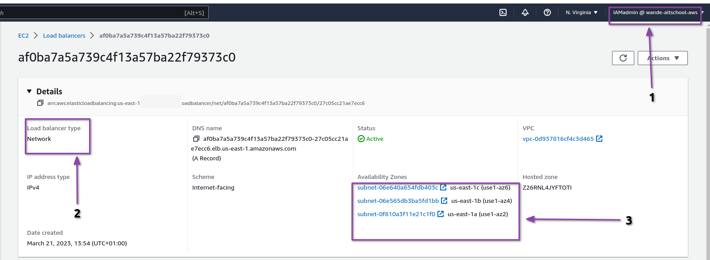

## domains: sigh,
- grafana dashboard: [https://grafana.wandexdev.me](https://grafana.wandexdev.me)
- socksshop deployment: [https://sock-shop.wandexdev.me](https://sock-shop.wandexdev.me)
- prometheus dashboard: [https://promethus.wandexdev.me](https://promethus.wandexdev.me)
- my nodejs-mongoDB web app: [https://webapp.wandexdev.me](https://webapp.wandexdev.me)

## infra in pictures (one's i could get before the lets-encrpt saga)
- socks-shop

- grafana UI dashboard (MONITORING)

- Promethus (METRICS) for the /metrics endpoint.

- Cloud Watch (LOGGING)

- webapp

- EKS

- NETWORK LOAD BALANCER (Serves all subdomains)

- Nodes instances

- SECURITY BEST PRACTICES: 3 private and 3 public subnets in all availabilty zones present in my own VPC in my region. I also observed best practices with my resorces creation

------------------------------
## Scenario
Thorughly Automated Infrasture creation and Deploymemt of 2 seperate appliactions (A microservices one and a fullstack webapp) to one **Amazon Elastic Kubernetes Service** (EKS) Cluster using **Terraform** and **Jenkins** CI/CD pipeline with **security best prsctices** and **Observabilty** (metrics, monitoring and logging) with Prometheus and Grafana UI. 

## Architecture:

