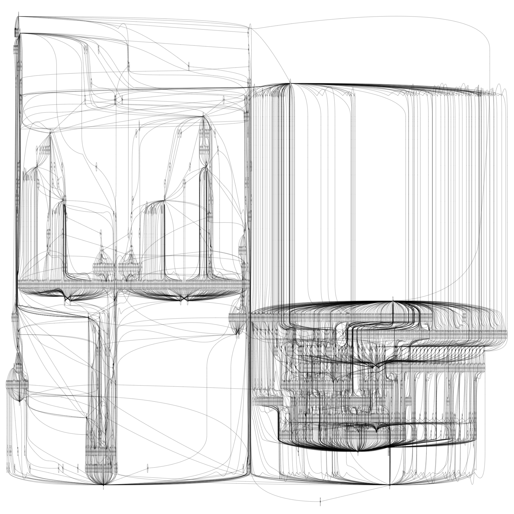

## steps for usage
- manually:
	- cd into this folder, ensure its your pwd
	- ```terraform init```
	- ```terraform plan```
	- (optional)```terraform graph -type plan  | dot -Tsvg > graph.svg```
	- ```terraform apply```
	- authenticate via ```eksctl utils write-kubeconfig --region <region> --cluster <cluster-name>```
	- Verify via ```kubectl get nodes```
- via jenkins:
	- assemble the above steps in a stage called EKS in your ```Jenkinsfile```
## Visualization

