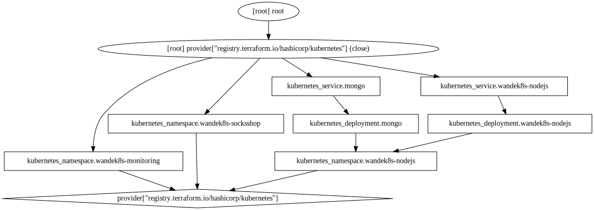

## steps for usage
- cd into this folderand ensure its your pwd
- ```terraform init```
- ```terraform plan```
- (optional) ```terraform graph -type plan  | dot -Tsvg > graph.svg```
- ```terraform apply```
- ```terraform state list``` to see the total resources created

## Visualization

