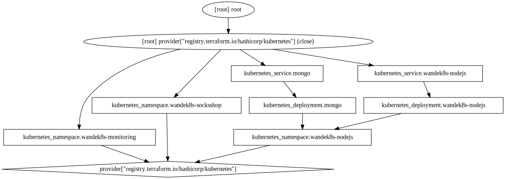

## steps for usage
- manually:
	- cd into this folderand ensure its your pwd
	- ```terraform init```
	- ```terraform plan```
	- (optional) ```terraform graph -type plan  | dot -Tsvg > graph.svg```
	- ```terraform apply```
	- ```terraform state list``` to see the total resources created
- via jenkins:
	- assemble the above steps in a stage called DEPLOY WEBAPP in your ```Jenkinsfile```

## Visualization

